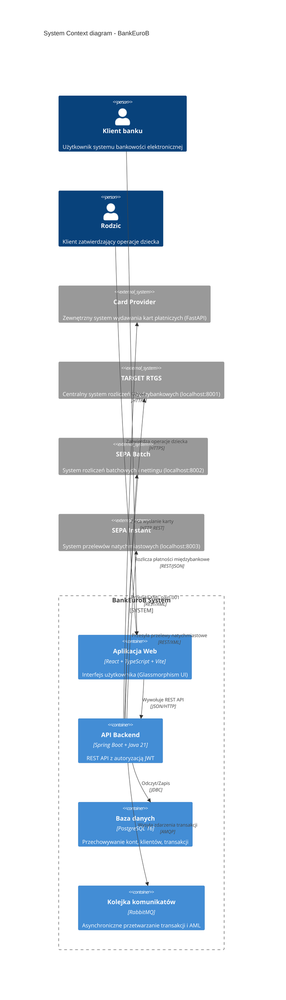
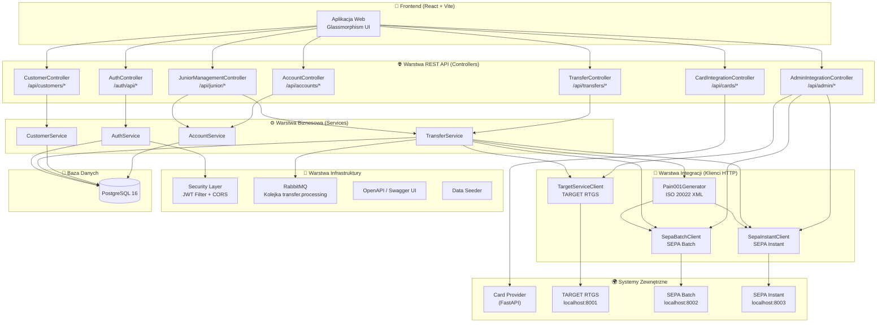
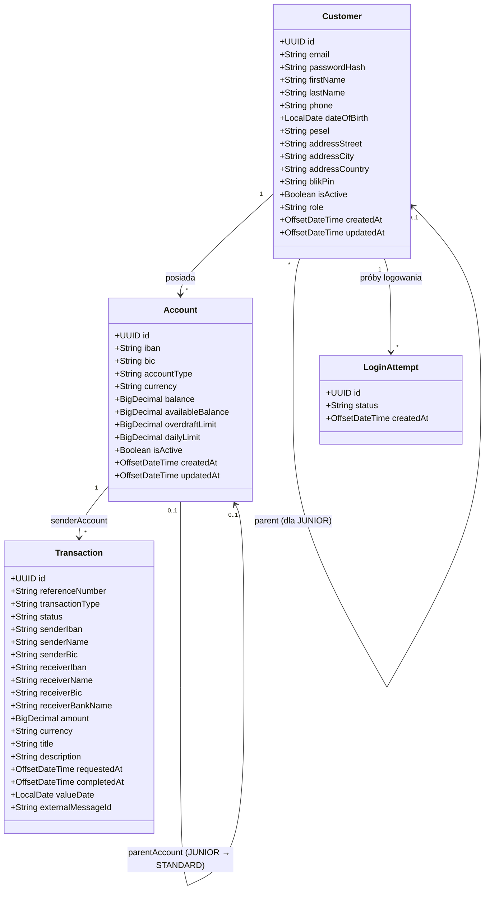
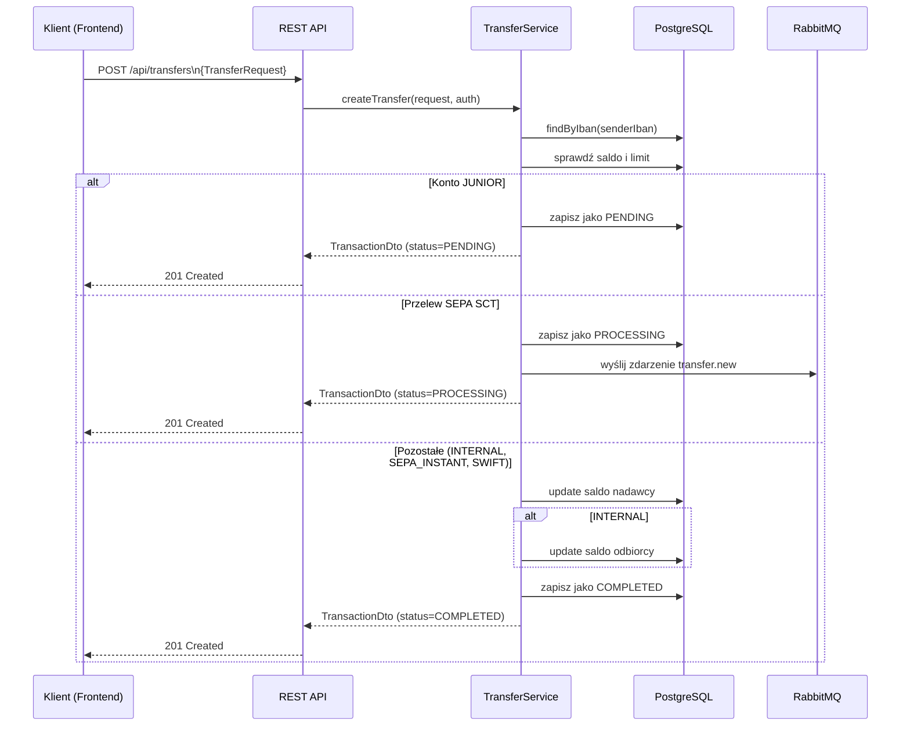
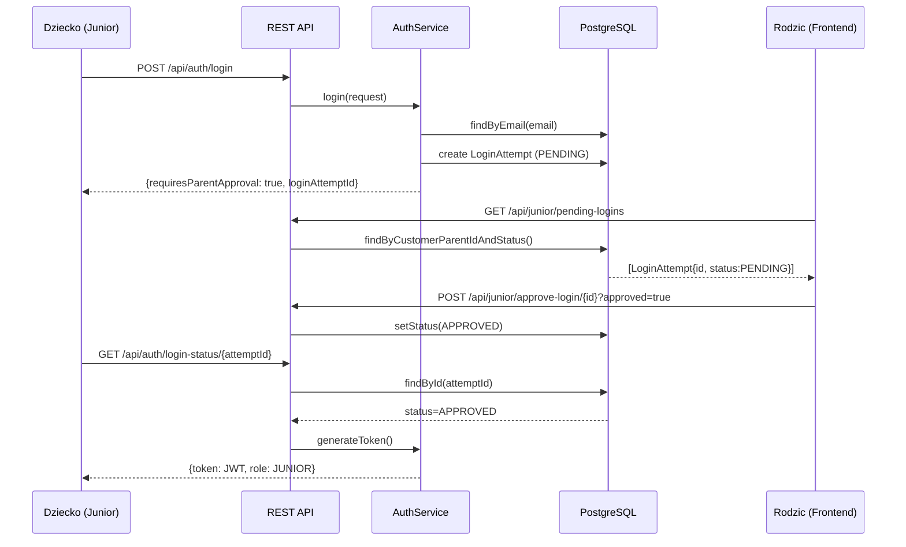
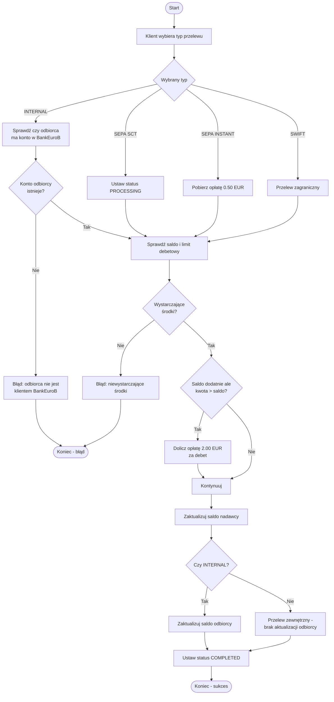
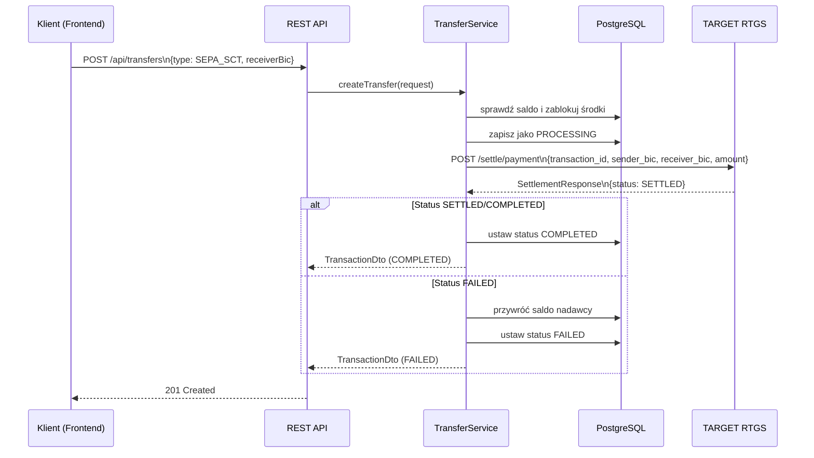
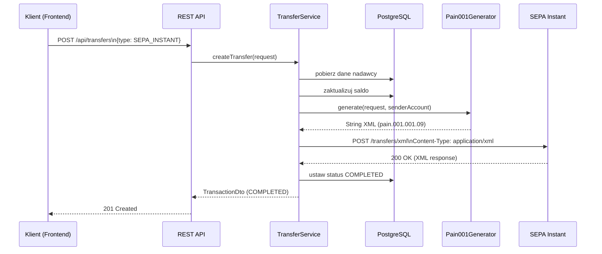

# BankEuroB

Nowoczesna aplikacja bankowa (Premium Banking) realizująca pełne środowisko Full-Stack. Architektura podzielona na backend napisany w Javie (Spring Boot) oraz piękny, interaktywny interfejs w React (Vite, TypeScript, autorski design Glassmorphism).

---

## Spis treści

1. [Wiedza domenowa — Bankowość elektroniczna](#wiedza-domenowa--bankowość-elektroniczna)
2. [Diagramy architektury systemu](#diagramy-architektury-systemu)
3. [Diagramy UML](#diagramy-uml)
4. [Diagramy BPMN — Procesy biznesowe](#diagramy-bpmn--procesy-biznesowe)
5. [Integracja z systemami zewnętrznymi](#integracja-z-systemami-zewnętrznymi)
6. [Jak uruchomić projekt lokalnie u siebie?](#jak-uruchomić-projekt-lokalnie-u-siebie)
7. [Dokumentacja API (Swagger)](#dokumentacja-api-swagger)
8. [Repozytorium](#repozytorium)

---

## Wiedza domenowa — Bankowość elektroniczna

### Opis dziedziny

**BankEuroB** to system bankowości elektronicznej (e-banking) obsługujący klientów indywidualnych w strefie euro (SEPA). System umożliwia zarządzanie kontami bankowymi, realizację przelewów krajowych i zagranicznych, zakładanie kont dziecięcych (Junior) z nadzorem rodzicielskim oraz integrację z zewnętrznymi systemami wydawania kart płatniczych.

### Kluczowe pojęcia domenowe

| Pojęcie | Opis |
|---|---|
| **Klient (Customer)** | Osoba fizyczna posiadająca konto w banku. Może mieć rolę: `CUSTOMER` (standardowy), `JUNIOR` (dziecko), `ADMIN`, `EMPLOYEE`. |
| **Konto bankowe (Account)** | Rachunek prowadzony w walucie EUR. Typy: `STANDARD` (podstawowe), `SAVINGS` (oszczędnościowe), `JUNIOR` (dziecięce). |
| **IBAN** | Międzynarodowy numer rachunku bankowego (ISO 13616). Format: `KK89` + 18 cyfr (np. `DE89370400440532013000`). |
| **BIC/SWIFT** | Kod identyfikacyjny banku: `BKEUDEBBXXX`. |
| **Przelew (Transfer)** | Dyspozycja przesłania środków z jednego rachunku na drugi. Typy: `INTERNAL`, `SEPA_SCT`, `SEPA_INSTANT`, `SWIFT`. |
| **Transakcja (Transaction)** | Zdarzenie księgowe rejestrujące przepływ środków. Statusy: `PENDING`, `PROCESSING`, `COMPLETED`, `REJECTED`, `FAILED`. |
| **Konto Junior** | Konto dla nieletnich (poniżej 18 lat), wymagające zgody rodzica na logowanie i przelewy powyżej limitu. |
| **BLIK** | System płatności mobilnych. Klient ustawia 4-cyfrowy PIN do autoryzacji transakcji BLIK. |
| **Limit debetowy (Overdraft)** | Możliwość przejścia salda poniżej zera do określonej kwoty. Dla pełnoletnich: 500 EUR domyślnie. |
| **RabbitMQ** | Kolejka komunikatów do asynchronicznego przetwarzania transakcji i monitorowania AML (Anti-Money Laundering). |
| **JWT (JSON Web Token)** | Mechanizm autoryzacji — token ważny 24h, przesyłany w nagłówku `Authorization: Bearer <token>`. |
| **TARGET RTGS** | Centralny system rozliczeń międzybankowych (Real-Time Gross Settlement) zarządzany przez bank centralny. Rozlicza płatności międzybankowe w czasie rzeczywistym. |
| **SEPA Batch** | System rozliczeń batchowych SEPA – grupuje przelewy SEPA SCT w sesje i wykonuje multilateral netting (kompensację wielostronną). |
| **SEPA Instant** | System przelewów natychmiastowych SEPA – przetwarza płatności w czasie rzeczywistym (24/7/365) w standardzie ISO 20022 XML pain.001. |
| **ISO 20022 (pain.001)** | Międzynarodowy standard XML dla zleceń płatniczych. Używany do komunikacji z SEPA Batch i SEPA Instant. |
| **Settlement (Rozliczenie)** | Proces transferu środków między bankami w systemie TARGET – obciążenie konta settlement nadawcy i uznanie konta settlement odbiorcy. |
| **Multilateral Netting** | Mechanizm kompensacji wzajemnych zobowiązań między wieloma bankami – zamiast wielu oddzielnych płatności, banki wymieniają się tylko saldami netto. |
| **Płynność międzybankowa** | Środki na koncie settlement banku w TARGET, niezbędne do realizacji rozliczeń. Zastrzyk płynności zwiększa dostępne saldo. |

### Reguły biznesowe

1. **Rejestracja** — nowy klient automatycznie otrzymuje konto STANDARD w EUR. Pełnoletni otrzymują limit debetowy 500 EUR.
2. **Konto Junior** — może założyć tylko rodzic (klient z rolą CUSTOMER). Dziecko otrzymuje rolę `JUNIOR`.
3. **Logowanie Juniora** — wymaga zgody rodzica. System tworzy `LoginAttempt` ze statusem `PENDING`. Rodzic zatwierdza lub odrzuca przez panel.
4. **Przelew z konta Junior** — zawsze ma status `PENDING` i wymaga zatwierdzenia przez rodzica.
5. **Przelew SEPA Instant** — pobiera opłatę 0.50 EUR.
6. **Przelew RTGS/TARGET2** — pobiera opłatę 5.00 EUR.
7. **Przelew na debecie** — jeśli saldo jest dodatnie ale niewystarczające na pokrycie kwoty + opłat, naliczana jest dodatkowa opłata 2.00 EUR.
8. **Przelew wewnętrzny (INTERNAL)** — odbiorca musi mieć konto w BankEuroB. Saldo odbiorcy aktualizowane jest natychmiast.
9. **BLIK** — PIN musi składać się z dokładnie 4 cyfr. Zmiana wymaga podania aktualnego PIN-u.
10. **Kod kraju** — musi być 2-znakowym kodem ISO 3166-1 alpha-2 (np. DE, PL, FR).

### Struktura organizacyjna banku

```
BankEuroB (BIC: BKEUDEBBXXX)
├── Dział IT / Rozwoju
│   ├── Backend (Spring Boot, Java 21)
│   ├── Frontend (React, TypeScript)
│   └── DevOps (Docker, PostgreSQL, RabbitMQ)
├── Dział Obsługi Klienta
│   └── Zarządzanie kontami klientów
├── Dział Kart Płatniczych
│   └── Integracja z zewnętrznym Card Provider (Payment Gateway)
└── Dział Compliance / AML
    └── Monitoring transakcji (RabbitMQ)
```

---

## Diagramy architektury systemu

### Architektura wysokiego poziomu (C4 — Container Diagram)



### Diagram warstw backendu



---

## Diagramy UML

### Diagram klas (Class Diagram) — model domenowy



### Diagram sekwencji — proces przelewu



### Diagram sekwencji — logowanie Juniora z zgodą rodzica



---

## Diagramy BPMN — Procesy biznesowe

### Proces: Zakładanie konta Junior

```mermaid
flowchart TD
    A([Start]) --> B[Rodzic loguje się do bankowości]
    B --> C[Wybiera opcję "Załóż konto Junior"]
    C --> D[Wypełnia formularz: dane dziecka]
    D --> E{Email dziecka\njuż zajęty?}
    E -->|Tak| F[Wyświetl błąd: email zajęty]
    F --> D
    E -->|Nie| G[System tworzy konto JUNIOR]
    G --> H[System tworzy konto bankowe\npowiązane z kontem rodzica]
    H --> I[Wyświetl potwierdzenie]
    I --> J([Koniec])
```

### Proces: Zatwierdzanie przelewu Juniora przez rodzica

```mermaid
flowchart TD
    A([Start]) --> B[Dziecko składa przelew]
    B --> C[System nadaje status PENDING]
    C --> D[Rodzic otrzymuje powiadomienie\n(panel oczekujących przelewów)]
    D --> E{Rodzic podejmuje decyzję}
    E -->|Zatwierdź| F{Sprawdź saldo\nkonta Junior}
    F -->|Wystarczające| G[Wykonaj przelew]
    F -->|Niewystarczające| H[Odrzuć przelew - brak środków]
    E -->|Odrzuć| I[Ustaw status REJECTED]
    G --> J[Ustaw status COMPLETED]
    H --> I
    I --> K([Koniec])
    J --> K
```

### Proces: Logowanie Juniora z nadzorem rodzica

```mermaid
flowchart TD
    A([Start]) --> B[Dziecko wprowadza email i hasło]
    B --> C{Poprawne dane?}
    C -->|Nie| D[Wyświetl błąd logowania]
    D --> B
    C -->|Tak| E{Rola = JUNIOR?}
    E -->|Nie| F[Generuj token JWT - zalogowano]
    E -->|Tak| G[Utwórz LoginAttempt (PENDING)]
    G --> H[Dziecko czeka na zgodę rodzica]
    H --> I[Rodzic sprawdza oczekujące logowania]
    I --> J{Rodzic zatwierdza?}
    J -->|Tak| K[Ustaw status APPROVED]
    J -->|Nie| L[Ustaw status REJECTED]
    K --> M[Dziecko odbiera token JWT]
    M --> N([Zalogowano])
    L --> O([Logowanie odrzucone])
    F --> N
```

### Proces: Realizacja przelewu bankowego



---

## Integracja z systemami zewnętrznymi

BankEuroB integruje się z trzema zewnętrznymi systemami do zarządzania rozliczeniami międzybankowymi:

### TARGET RTGS (Central Bank Settlement)

**URL:** `http://localhost:8001`

System rozliczeń brutto w czasie rzeczywistym (RTGS) zarządzany przez bank centralny. Odpowiada za:
- Rejestrację banków w systemie (BIC, nazwa)
- Rozliczanie płatności międzybankowych (settlement)
- Zarządzanie płynnością (zastrzyki, blokady)

**Integracja:** [`TargetServiceClient`](backend/src/main/java/com/bankeurob/integration/target/TargetServiceClient.java) → [`POST /settle/payment`](backend/src/main/java/com/bankeurob/integration/target/TargetServiceClient.java:74) dla przelewów SEPA_SCT i SWIFT.

### SEPA Batch Service

**URL:** `http://localhost:8002`

System rozliczeń batchowych SEPA z multilateral nettingiem. Odpowiada za:
- Przyjmowanie plików XML pain.001 z przelewami SEPA SCT
- Grupowanie przelewów w sesje rozliczeniowe
- Wykonywanie multilateral nettingu (kompensacja wielostronna)

**Integracja:** [`SepaBatchClient`](backend/src/main/java/com/bankeurob/integration/sepa/batch/SepaBatchClient.java) → [`POST /transfers/xml`](backend/src/main/java/com/bankeurob/integration/sepa/batch/SepaBatchClient.java:34)

### SEPA Instant Service

**URL:** `http://localhost:8003`

System przelewów natychmiastowych SEPA (24/7/365). Odpowiada za:
- Przyjmowanie przelewów natychmiastowych w formacie XML pain.001
- Przetwarzanie w czasie rzeczywistym
- Udostępnianie statusu przelewów

**Integracja:** [`SepaInstantClient`](backend/src/main/java/com/bankeurob/integration/sepa/instant/SepaInstantClient.java) → [`POST /transfers/xml`](backend/src/main/java/com/bankeurob/integration/sepa/instant/SepaInstantClient.java:34)

### Diagram sekwencji — przelew SEPA z integracją TARGET



### Diagram sekwencji — przelew SEPA Instant z generowaniem XML



### Generowanie XML ISO 20022

Klasa [`Pain001Generator`](backend/src/main/java/com/bankeurob/integration/xml/Pain001Generator.java) generuje dokumenty XML zgodne ze standardem **ISO 20022 pain.001.001.09** (CustomerCreditTransferInitiation). Struktura XML:

```
<Document>
  <CstmrCdtTrfInitn>
    <GrpHdr>          ← nagłówek grupy (MessageId, CreDtTm, NbOfTxs, CtrlSum)
    <PmtInf>          ← informacja o płatności
      <PmtMtd>TRF</PmtMtd>
      <NbOfTxs>1</NbOfTxs>
      <PmtTpInf>      ← typ płatności (SCT/INST)
      <ReqdExctnDt>   ← data wykonania
      <Dbtr>           ← dane nadawcy (nazwa, adres)
      <DbtrAcct>       ← konto nadawcy (IBAN)
      <CdtTrfTxInf>    ← szczegóły przelewu
        <Amt>          ← kwota
        <Cdtr>         ← dane odbiorcy
        <CdtrAcct>     ← konto odbiorcy (IBAN)
        <RmtInf>       ← tytuł przelewu
```

---

## Jak uruchomić projekt lokalnie u siebie?

Aby projekt zadziałał, musisz posiadać zainstalowane:
- **Docker** (i Docker Compose)
- **Java 17**
- **Node.js** (rekomendowane v18+)

### Krok 1: Włączenie bazy danych (Docker)
W głównym folderze projektu uruchom kontener PostgreSQL oraz opcjonalnie RabbitMQ wpisując polecenie:
```bash
docker compose up -d
```
> [!NOTE]
> Baza PostgreSQL wystartuje na porcie **5433** (hasło `root`, użytkownik `root`), dzięki czemu nie wejdzie w konflikt z lokalnymi instalacjami na Twoim komputerze.

### Krok 2: Uruchomienie Backend'u (Spring Boot)
Otwórz terminal w folderze `backend` i użyj dołączonego narzędzia Gradle (pobierze on wszystkie pakiety oraz zainstaluje schematy w bazie poprzez Flyway):

**Windows:**
```bash
cd backend
.\gradlew.bat bootRun
```
**Mac/Linux:**
```bash
cd backend
./gradlew bootRun
```
> [!IMPORTANT]
> Poczekaj aż konsola wypisze 🟢 `Started BankEuroBApplication in X seconds`. Przy pierwszym starcie system automatycznie wstrzyknie testowe konta (m.in. `anna.kowalski@example.com`).

### Krok 3: Uruchomienie Frontend'u (React + Vite)
Otwórz nowy, osobny terminal w folderze `frontend`. Zainstaluj pakiety i wystartuj aplikację:
```bash
cd frontend
npm install
npm run dev
```

### Krok 4: Gotowe! 
Aplikacja jest już w pełni funkcjonalna:
- Strona (Frontend) dostępna jest pod adresem: [http://localhost:5173/](http://localhost:5173/)
- Endpointy API (Backend) działają pod adresem: `http://localhost:8080/`

**Dane konta testowego:**
- Email: `anna.kowalski@example.com`
- Hasło: `password123`

---

## Dokumentacja API (Swagger)

Dokumentacja REST API dostępna jest w standardzie **OpenAPI 3.0** (Swagger) po uruchomieniu backendu:

- **Swagger UI:** [http://localhost:8080/swagger-ui.html](http://localhost:8080/swagger-ui.html)
- **OpenAPI JSON:** [http://localhost:8080/v3/api-docs](http://localhost:8080/v3/api-docs)

### Endpointy API

| Metoda | Ścieżka | Opis | Autoryzacja |
|---|---|---|---|
| `POST` | `/api/auth/register` | Rejestracja nowego klienta | ❌ |
| `POST` | `/api/auth/login` | Logowanie klienta | ❌ |
| `GET` | `/api/auth/login-status/{attemptId}` | Sprawdź status logowania Juniora | ❌ |
| `GET` | `/api/accounts` | Lista kont zalogowanego klienta | ✅ JWT |
| `GET` | `/api/accounts/{id}` | Szczegóły konta | ✅ JWT |
| `GET` | `/api/customers/me` | Profil klienta | ✅ JWT |
| `PUT` | `/api/customers/me` | Aktualizacja danych kontaktowych | ✅ JWT |
| `PUT` | `/api/customers/me/blik-pin` | Zmiana PIN BLIK | ✅ JWT |
| `POST` | `/api/transfers` | Zlecenie przelewu | ✅ JWT |
| `GET` | `/api/transfers?iban=...` | Historia transakcji | ✅ JWT |
| `POST` | `/api/junior/account` | Założenie konta Junior | ✅ JWT |
| `GET` | `/api/junior/pending-logins` | Oczekujące logowania Juniora | ✅ JWT |
| `POST` | `/api/junior/approve-login/{id}?approved=true/false` | Zatwierdź/odrzuć logowanie Juniora | ✅ JWT |
| `GET` | `/api/junior/pending-transfers` | Oczekujące przelewy Juniora | ✅ JWT |
| `POST` | `/api/junior/approve-transfer/{id}?approved=true/false` | Zatwierdź/odrzuć przelew Juniora | ✅ JWT |
| `POST` | `/api/cards/integrate` | Zleć wydanie karty (zewnętrzny system) | ✅ JWT |
| `POST` | `/api/admin/register-bank` | Rejestracja banku w TARGET RTGS | ✅ JWT |
| `GET` | `/api/admin/target/banks` | Lista banków w TARGET | ✅ JWT |
| `GET` | `/api/admin/target/banks/{bic}` | Szczegóły banku w TARGET | ✅ JWT |
| `POST` | `/api/admin/target/banks/{bic}/block` | Blokada banku w TARGET | ✅ JWT |
| `POST` | `/api/admin/target/banks/{bic}/unblock` | Odblokowanie banku w TARGET | ✅ JWT |
| `POST` | `/api/admin/target/liquidity` | Zastrzyk płynności w TARGET | ✅ JWT |
| `GET` | `/api/admin/sepa/sessions` | Lista sesji SEPA Batch | ✅ JWT |
| `GET` | `/api/admin/sepa/sessions/{id}` | Szczegóły sesji SEPA Batch | ✅ JWT |
| `POST` | `/api/admin/sepa/sessions/{id}/close` | Zamknięcie sesji (netting) | ✅ JWT |
| `GET` | `/api/admin/sepa/instant` | Lista przelewów SEPA Instant | ✅ JWT |
| `GET` | `/api/admin/sepa/instant/{id}` | Status przelewu SEPA Instant | ✅ JWT |

### Schematy DTO

Szczegółowe schematy wszystkich obiektów DTO (`LoginRequest`, `RegisterRequest`, `AuthResponse`, `AccountDto`, `TransferRequest`, `TransactionDto`, `UpdateCustomerRequest`, `BlikPinRequest`, `JuniorAccountRequest`, `Customer`, `ErrorResponse`, `PendingLogin`, `CardIntegrationResponse`, `BankCreateRequest`, `BankResponse`, `BankDetailResponse`, `SettlementAccountResponse`, `SettlementRequest`, `SettlementResponse`, `LiquidityInjectionRequest`, `LiquidityInjectionResponse`, `TransferStatusResponse`) dostępne są w Swagger UI.

---

## Repozytorium

Projekt dostępny jest na GitHub:
- **URL:** [https://github.com/Poudretteite/BankEuroB](https://github.com/Poudretteite/BankEuroB)
- **Język:** Java 21 (Spring Boot) + TypeScript (React/Vite)
- **Licencja:** Proprietary
