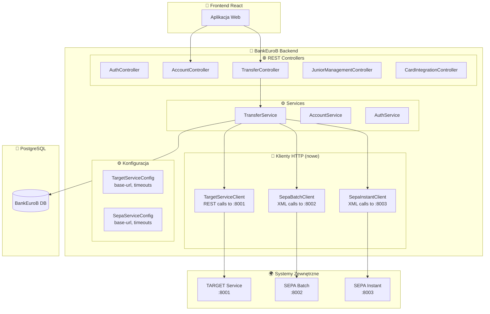
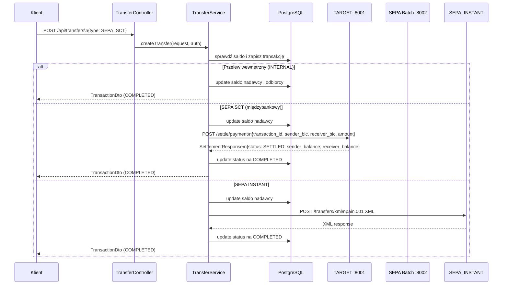
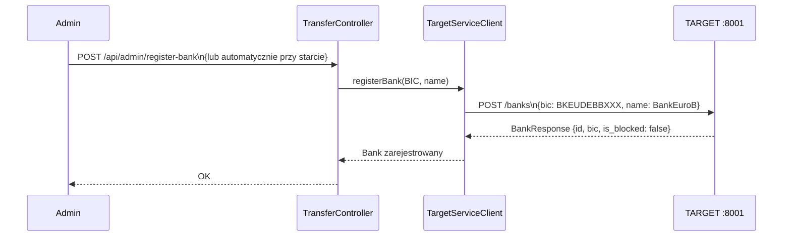
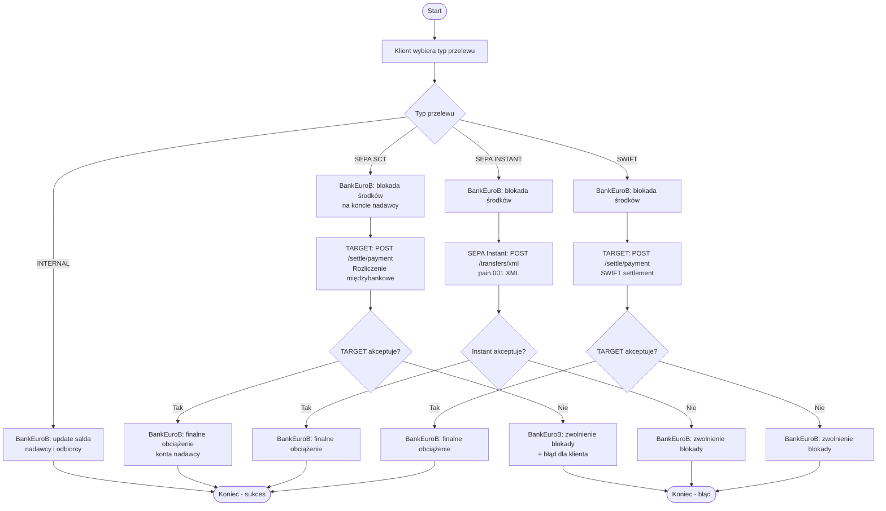

# Plan integracji BankEuroB z zewnętrznymi API

## Przegląd

BankEuroB ma zostać zintegrowany z 3 zewnętrznymi systemami rozliczeniowymi:

| Port | Serwis | Opis | Technologia |
|---|---|---|---|
| 8001 | **TARGET Service** | Centralny system rozliczeń RTGS banku centralnego | FastAPI |
| 8002 | **SEPA Batch Service** | Clearing SEPA batch i multilateral netting | FastAPI |
| 8003 | **SEPA Instant Service** | Natychmiastowe płatności SEPA i gridlock resolution | FastAPI |

---

## 1. Analiza API

### 1.1 TARGET Service (port 8001) — Central Bank RTGS

**Endpointy:**

| Metoda | Ścieżka | Opis |
|---|---|---|
| `GET` | `/banks` | Lista wszystkich banków w systemie |
| `POST` | `/banks` | Rejestracja nowego banku |
| `GET` | `/banks/{bic}` | Szczegóły banku (w tym konta settlement) |
| `POST` | `/banks/block/{bic}` | Blokada banku |
| `POST` | `/banks/unblock/{bic}` | Odblokowanie banku |
| `POST` | `/settle/payment` | Rozliczenie płatności międzybankowej |
| `POST` | `/liquidity/injection` | Zastrzyk płynności dla banku |

**Schematy:**
- `BankCreate` — `{bic, name}`
- `BankResponse` — `{bic, name, id, is_blocked, created_at}`
- `BankDetailResponse` — rozszerzony o `settlement_accounts[]`
- `SettlementRequest` — `{transaction_id, sender_bic, receiver_bic, amount, currency, description, service}`
- `SettlementResponse` — `{transaction_id, status, settled_at, sender_balance, receiver_balance}`
- `LiquidityInjectionRequest` — `{bank_bic, amount, currency}`
- `LiquidityInjectionResponse` — `{transfer_id, bank_bic, amount, new_balance}`

### 1.2 SEPA Batch Service (port 8002) — SEPA Batch Clearing

**Endpointy:**

| Metoda | Ścieżka | Opis |
|---|---|---|
| `POST` | `/transfers/xml` | Przesłanie pliku XML z przelewami batch |
| `GET` | `/sessions` | Lista sesji rozliczeniowych |
| `GET` | `/sessions/{session_id}` | Szczegóły sesji |
| `POST` | `/sessions/close/{session_id}` | Zamknięcie sesji (netting) |

**Uwaga:** Komunikacja XML — wymaga generowania pain.001 XML.

### 1.3 SEPA Instant Service (port 8003) — SEPA Instant Payments

**Endpointy:**

| Metoda | Ścieżka | Opis |
|---|---|---|
| `POST` | `/transfers/xml` | Przesłanie przelewu natychmiastowego XML |
| `GET` | `/transfers/{transfer_id}` | Status przelewu instant |
| `GET` | `/transfers` | Lista wszystkich przelewów instant |

**Schematy:**
- `TransferStatusResponse` — `{transfer_id, status, processed_at, error_message}`

---

## 2. Architektura integracji

### 2.1 Diagram warstw — nowa architektura



### 2.2 Diagram sekwencji — przepływ przelewu SEPA SCT z settlement



### 2.3 Diagram sekwencji — rejestracja BankEuroB w TARGET



---

## 3. Nowe pliki do utworzenia

### 3.1 Klienty HTTP (nowa paczka: `backend/src/main/java/com/bankeurob/integration/`)

```
backend/src/main/java/com/bankeurob/integration/
├── target/
│   ├── TargetServiceClient.java        # REST client do TARGET :8001
│   ├── dto/
│   │   ├── BankCreateRequest.java
│   │   ├── BankResponse.java
│   │   ├── BankDetailResponse.java
│   │   ├── SettlementRequest.java
│   │   ├── SettlementResponse.java
│   │   ├── LiquidityInjectionRequest.java
│   │   └── LiquidityInjectionResponse.java
│   └── config/
│       └── TargetServiceConfig.java
├── sepa/
│   ├── batch/
│   │   ├── SepaBatchClient.java        # HTTP/XML client do SEPA Batch :8002
│   │   └── config/
│   │       └── SepaBatchConfig.java
│   └── instant/
│       ├── SepaInstantClient.java      # HTTP/XML client do SEPA Instant :8003
│       ├── dto/
│       │   └── TransferStatusResponse.java
│       └── config/
│           └── SepaInstantConfig.java
└── xml/
    ├── Pain001Generator.java           # Generator XML pain.001 dla SEPA
    └── templates/
        └── pain001.mustache            # Szablon XML (lub ręczne budowanie)
```

### 3.2 Modyfikacje istniejących plików

| Plik | Zmiana |
|---|---|
| `TransferService.java` | Dodanie wywołań `TargetServiceClient`, `SepaBatchClient`, `SepaInstantClient` w zależności od `transferType` |
| `TransferRequest.java` | Dodanie pola `receiverBic` (wymagane dla SEPA/SWIFT) |
| `Transaction.java` | Dodanie pola `receiverBic` (już istnieje!) i `externalMessageId` (już istnieje!) |
| `application.yml` | Dodanie konfiguracji URL-i dla 3 serwisów |
| `docker-compose.yml` | Dodanie serwisów dla 3 zewnętrznych API (opcjonalnie, jeśli są w kontenerach) |
| `build.gradle` | Dodanie zależności `okhttp` lub `webclient` jeśli potrzebne (ale `RestTemplate` już jest używany) |
| `OpenApiConfig.java` | Dodanie schematów DTO dla nowych endpointów integracyjnych |

### 3.3 Nowe endpointy REST w BankEuroB

| Metoda | Ścieżka | Opis |
|---|---|---|
| `POST` | `/api/admin/register-bank` | Rejestracja BankEuroB w TARGET (automatycznie lub ręcznie) |
| `GET` | `/api/admin/target/banks` | Lista banków z TARGET |
| `GET` | `/api/admin/target/banks/{bic}` | Szczegóły banku z TARGET |
| `POST` | `/api/admin/target/liquidity` | Zastrzyk płynności |
| `GET` | `/api/admin/sepa/sessions` | Lista sesji SEPA Batch |
| `GET` | `/api/admin/sepa/instant/{id}` | Status przelewu instant |

---

## 4. Logika integracji w TransferService

### Modyfikacja metody `createTransfer()`

```java
// W istniejącej metodzie createTransfer(), po zapisaniu transakcji:

if ("INTERNAL".equals(request.getTransferType())) {
    // istniejąca logika - aktualizacja salda odbiorcy
} else if ("SEPA_SCT".equals(request.getTransferType())) {
    // NOWA: wyślij do TARGET settlement
    SettlementResponse settlement = targetClient.settlePayment(
        new SettlementRequest(tx.getId(), senderAccount.getBic(), 
            request.getReceiverBic(), request.getAmount(), "EUR", 
            request.getTitle(), "SCT")
    );
    tx.setStatus("COMPLETED");
    tx.setExternalMessageId(settlement.getTransactionId());
} else if ("SEPA_INSTANT".equals(request.getTransferType())) {
    // NOWA: wyślij XML do SEPA Instant
    String xml = pain001Generator.generate(request, senderAccount);
    String responseXml = sepaInstantClient.submitInstantTransfer(xml);
    tx.setStatus("COMPLETED");
} else if ("SWIFT".equals(request.getTransferType())) {
    // NOWA: wyślij do TARGET settlement (SWIFT też przez RTGS)
    SettlementResponse settlement = targetClient.settlePayment(...);
    tx.setStatus("COMPLETED");
}
```

---

## 5. Konfiguracja (application.yml)

```yaml
# Nowe sekcje w application.yml
integration:
  target:
    base-url: http://localhost:8001
    connect-timeout: 5000
    read-timeout: 10000
  sepa:
    batch:
      base-url: http://localhost:8002
      connect-timeout: 5000
      read-timeout: 30000
    instant:
      base-url: http://localhost:8003
      connect-timeout: 5000
      read-timeout: 10000
```

---

## 6. Diagram BPMN — nowy proces przelewu międzybankowego



---

## 7. Lista zadań (TODO)

### Faza 1: Klienty HTTP i DTO
- [ ] Utworzyć paczkę `integration/target/` z DTO i klientem REST dla TARGET :8001
- [ ] Utworzyć paczkę `integration/sepa/batch/` z klientem XML dla SEPA Batch :8002
- [ ] Utworzyć paczkę `integration/sepa/instant/` z klientem XML i DTO dla SEPA Instant :8003
- [ ] Utworzyć generator XML pain.001 (`Pain001Generator`)
- [ ] Dodać konfigurację URL-i i timeoutów w `application.yml`

### Faza 2: Modyfikacja TransferService
- [ ] Dodać `receiverBic` do `TransferRequest` (wymagane dla SEPA/SWIFT)
- [ ] Zmodyfikować `TransferService.createTransfer()` — wywołanie TARGET dla SEPA_SCT i SWIFT
- [ ] Zmodyfikować `TransferService.createTransfer()` — wywołanie SEPA Instant dla SEPA_INSTANT
- [ ] Dodać obsługę błędów i rollback przy nieudanym settlement

### Faza 3: Endpointy administracyjne
- [ ] Utworzyć `AdminIntegrationController` z endpointami do zarządzania integracją
- [ ] Dodać endpoint rejestracji banku w TARGET
- [ ] Dodać endpoint do sprawdzania statusu banków w TARGET
- [ ] Dodać endpoint do zastrzyków płynności

### Faza 4: Dokumentacja i testy
- [ ] Zaktualizować `README.md` o opis integracji z 3 systemami
- [ ] Zaktualizować diagramy architektury w README
- [ ] Dodać dokumentację nowych endpointów w Swagger/OpenApiConfig
- [ ] Przetestować przepływ SEPA SCT przez TARGET
- [ ] Przetestować przepływ SEPA INSTANT przez SEPA Instant Service
